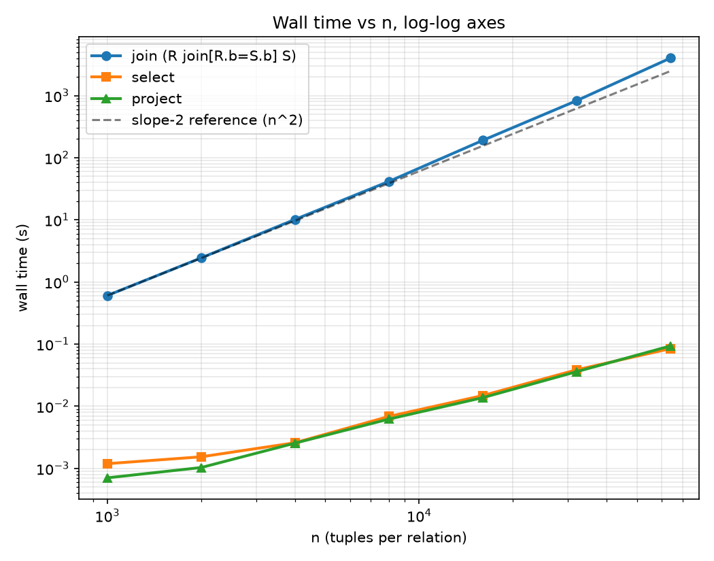

# REPORT.md — Performance Study

All numbers below are measured, not estimated, from the final
implementation (join counter incremented per-pair inside the loop, per
the course forum's Section 8.2 rewrite; streaming join, not a
materialized product -- see DESIGN_LOG.md for both of those fixes and why
they were needed).

## Machine

- **CPU:** AMD Ryzen 7 8845HS (8 cores / 16 threads)
- **OS:** Windows 11 (build 10.0.26200)
- **Language / runtime:** Python 3.13.1 (CPython, MSC v.1942 64-bit)
- All timings are single-threaded, one query at a time, nothing else
  competing for the CPU intentionally (background system processes aside).

## Methodology

- `perf/datagen.py` generates `R(a, b)` and `S(b, c)`: `a`/`c` are just the
  row index, `b` is drawn uniformly from a domain of size
  `D = round(n_s / match_rate)`, so a given R-tuple is expected to match
  `match_rate` S-tuples. Section 8.3's main table uses `match_rate = 1.0`.
- `perf/run_experiment.py` loads the generated `.ra` files through the
  engine's normal tokenizer/parser (so the load itself exercises the real
  system, though load time is *not* included in the timed portion), then
  times exactly one call to `evaluate()` for `R join[R.b=S.b] S` with
  `time.perf_counter()`, and reads `join_compared` off
  `src.interpreter.COUNTERS` immediately after.
- `join_compared` is incremented once per pair, literally inside the
  nested loop, immediately before the join condition's result is known --
  matching the course forum's Section 8.2 rewrite: "a counter inside your
  join implementation, incremented once for every pair of tuples the join
  condition is evaluated on, whether or not the pair matches." (An earlier
  version computed this as `len(left.tuples) * len(right.tuples)` up
  front -- the exact same number, since nothing in the loop ever skips a
  pair, but the rewritten spec asks for a literal per-pair counter, so
  that's what's there now. See DESIGN_LOG.md for the earlier
  double-counting bug this replaced.) `select_examined` is the matching
  per-operator counter for `select`, incremented once per tuple the
  selection condition is evaluated on.
- To reproduce: `python -m perf.run_experiment --out perf/results.csv`
  (add `--sizes` / `--match-rate` / `--seed` to change the run; expect
  roughly 80 minutes for the default 1000–64000 range on comparable
  hardware). The script writes each row to the CSV as it completes, so a
  partial run's results survive an interruption -- which mattered once,
  see DESIGN_LOG.md.
- The log-log plot is regenerated from `perf/results.csv` and
  `perf/results.selectproject.csv` with matplotlib; see
  `perf/plot_results.py`.

## 8.3 — Main experiment: `R join[R.b=S.b] S`

match rate = 1.0, seed = 42

| n | m | comparisons | wall time (s) | output tuples |
|---|---|---|---|---|
| 1000 | 1000 | 1,000,000 | 0.6056 | 961 |
| 2000 | 2000 | 4,000,000 | 2.4425 | 1,975 |
| 4000 | 4000 | 16,000,000 | 10.1600 | 3,995 |
| 8000 | 8000 | 64,000,000 | 41.5490 | 8,057 |
| 16000 | 16000 | 256,000,000 | 190.2433 | 16,294 |
| 32000 | 32000 | 1,024,000,000 | 828.4470 | 31,969 |
| 64000 | 64000 | 4,096,000,000 | 4014.8254 | 64,033 |

Total run time for the whole table: ~84 minutes. *(raw CSV:
[perf/results.csv](perf/results.csv))*



## 8.4 — Analysis

### Q1. Relationship between n, m and the comparison count

`comparisons = n * m`, **exactly**, at every single row of the table above
(verified programmatically: `n*m == comparisons` for all 7 rows, no
tolerance needed). This isn't really a "discovered" relationship so much
as a designed-in one -- `join_compared` is incremented by exactly 1 for
every single pair the nested loop visits (see `src/interpreter.py`,
`Join` branch), unconditionally, before the condition's result is even
known, and a nested loop over all of `R` and all of `S` visits every pair
without exception -- so there is no discrepancy to explain: a nested-loop
join with no index pairs every `R`-tuple with every `S`-tuple, full stop,
and the counter reports exactly that, not an estimate of it.

### Q2. Wall time vs n on log-log axes

See the plot above (`perf/time_vs_n_loglog.png`, regenerate with
`python -m perf.plot_results`). A least-squares fit of `log10(time)` against
`log10(n)` over all 7 points gives:

**slope ≈ 2.112**

That's very close to 2, which is exactly what `O(n*m) = O(n^2)` (since
`m = n` throughout this table) predicts: on log-log axes, `time ∝ n^k`
shows up as a straight line of slope `k`, and a quadratic algorithm's line
has slope 2. The small excess over 2.0 (≈0.11) is consistent with
per-tuple constant-factor growth as `n` increases -- larger `n` means
larger Python `set` objects for both the base relations and (variably)
the output, which means more hash-table resizing and worse cache locality
per operation, so the "constant" work per comparison isn't perfectly
constant across three orders of magnitude of `n`. It's a second-order
effect on top of the dominant `n^2` term, not a different growth class.

### Q3. Select and project at the same sizes

(`perf/results.selectproject.csv`, `select[b=0](R)` / `project[b](R)` on
the same generated `R` at each size.)

| n | select time (s) | project time (s) |
|---|---|---|
| 1000 | 0.0012 | 0.0007 |
| 2000 | 0.0015 | 0.0010 |
| 4000 | 0.0026 | 0.0026 |
| 8000 | 0.0069 | 0.0062 |
| 16000 | 0.0149 | 0.0138 |
| 32000 | 0.0387 | 0.0360 |
| 64000 | 0.0847 | 0.0936 |

Log-log slopes: **select ≈ 1.081**, **project ≈ 1.208** -- both close to
1, confirming both are `O(n)`: each examines every one of R's `n` tuples
exactly once (`select_examined` in the CSV is literally `n` at every row,
by construction). At n=64000 the join took **4015 seconds**; select and
project took **0.085s** and **0.094s** -- roughly **47,000x** and
**43,000x** faster respectively, which is the visible gap between the
flat select/project lines and the steep join line in the plot above.
`project`'s slope is a bit higher than `select`'s, consistent with the
prediction that deduplicating the projected tuples through a `set` adds a
hashing/rehashing cost on top of the same single pass `select` does.

### Q4. Predicting the 1,000,000-tuple join (not run)

Using the measured `t64k = 4014.8254` s and `comparisons ∝ n^2` (confirmed
by the ≈2.1 slope in Q2, so the per-comparison cost is effectively
constant across this range):

```
predicted_time ≈ t64k * (1,000,000 / 64,000)^2
             = 4014.8254 * (15.625)^2
             = 4014.8254 * 244.14...
             ≈ 980,182 seconds
             ≈ 16,336 minutes
             ≈ 272.3 hours
             ≈ 11.3 days
```

Eleven and a third days of continuous single-threaded computation for one
join. That's the entire point of Section 8: a correct, naive nested-loop
implementation is *fine* at the scale this project tests it at (about a
minute and a half at 16,000, growing to just over an hour at 64,000), and
completely infeasible one order of magnitude past that -- not because of
a bug, but because `O(n^2)` growth is what it is.

### Q5. Does match rate change the comparison count? The wall time?

**Measured** (supplementary run, n=m=3000, seed=7, four match rates, run
in isolation with nothing else competing for the CPU,
`perf/match_rate_results.csv`):

| match rate | domain size | comparisons | wall time (s) | output tuples |
|---|---|---|---|---|
| 0.5 | 6000 | 9,000,000 | 5.5547 | 1,470 |
| 1 | 3000 | 9,000,000 | 5.4984 | 2,872 |
| 5 | 600 | 9,000,000 | 5.4636 | 15,076 |
| 20 | 150 | 9,000,000 | 5.3442 | 59,728 |

**Comparison count: no** -- it is exactly `n * m = 9,000,000` at every
match rate, because a nested-loop join has no way to know which pairs
will match without first generating and testing them; it evaluates the
condition on literally every pair regardless of how selective that
condition turns out to be.

**Wall time: essentially no** -- all four runs land within a ~4% band
(5.34s–5.55s) despite the output size varying by 40x (1,470 to 59,728
tuples). There's a small, consistent downward trend as match rate
increases (equivalently, as domain size shrinks), which is more likely
CPython-specific than a real join-cost effect: a smaller domain means the
join-key values are small integers, and CPython caches (interns) small
integer objects (`-5` to `256`), so at domain=150 essentially every `b`
value is a cached object while at domain=6000 most aren't -- that can make
hashing/comparing those integers marginally cheaper, independent of
anything about the join algorithm itself. Either way, the effect is a
small constant-factor wobble, not a trend that scales with match rate the
way it would under an index-based join.

**Why the two answers are the same:** both come from the same root cause
-- a naive nested-loop join has no shortcut that lets selectivity reduce
its work. An index or a hash join *would* make match rate matter (fewer
matches → less time spent on the matching/output-building step even
though the probe cost might stay proportional to input size), but that's
exactly the class of technique this project's scope excludes (Section 3:
"Indexes, hash joins and sort-merge joins are likewise excluded").

### Q6. What would make the million-tuple join feasible?

The bottleneck is that every `R`-tuple has to linearly scan all of `S` to
find its matches, because nothing tells it where to look. An index on the
join column -- e.g. a hash index mapping each `S.b` value to the list of
`S`-tuples with that value -- turns that per-`R`-tuple cost from "scan all
`m` tuples of `S`" into "one hash lookup, then only visit the tuples that
actually match", which is `O(1)` amortized per probe rather than `O(m)`.
That takes the whole join from `O(n * m)` down to roughly
`O(n + m + output size)`: build the index over `S` once (`O(m)`), then do
`n` cheap lookups instead of `n` full scans. A sort-merge join gets a
similar win a different way -- sort both sides by the join key
(`O(n log n + m log m)`) and then walk them together in one linear pass.
Either technique is exactly what's excluded from this project's scope
(Section 3) and exactly what the assignment says the next bonus project
builds on top of this one -- which tracks: you can't meaningfully build an
index without first having a working, correct nested-loop baseline to
compare it against and prove it's actually faster.
